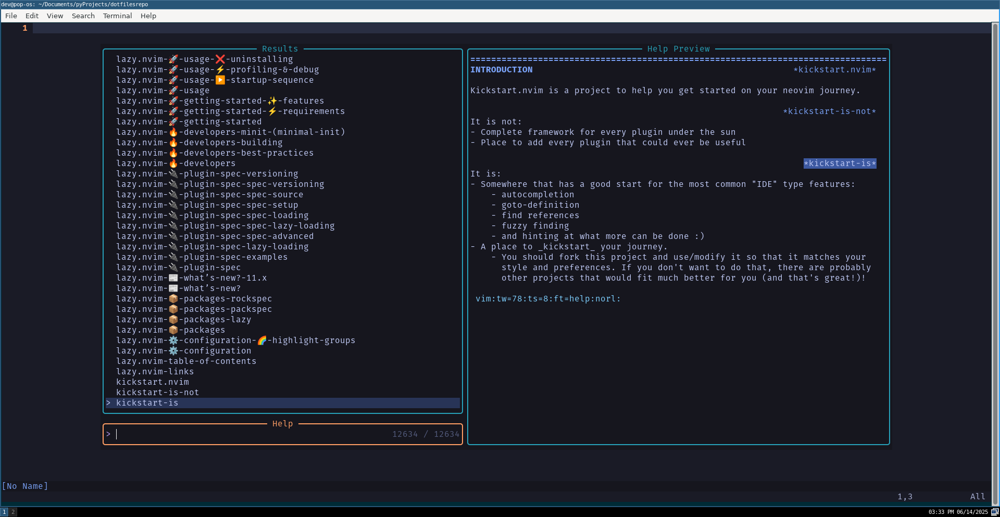

# My Dotfiles

My personal configuration files for Neovim and i3.

## Neovim Configuration

I'm using a customized [Kickstart.nvim](https://github.com/nvim-lua/kickstart.nvim) configuration, tailored to my needs for efficient coding and text editing.
To loadup kickstart input:
git clone https://github.com/nvim-lua/kickstart.nvim "${XDG_CONFIG_HOME:-$HOME/.config}"/nvim

## i3 Configuration

My i3 config includes a few tweaks to improve productivity, notably:

* **Caps Lock as Extra Escape Key**: I've remapped Caps Lock to act as an additional Escape key, making it easier to exit insert mode in Vim and improving overall Vim navigation.
* After modding your .config/I3/config hit <mod>+shift+r to reload your I3 for changes to take effect.

## Features

* Customized Neovim setup with Kickstart.nvim
* i3 config with Caps Lock remapped to Escape
* i3 added screenshot capability with mod shift s and saves to screenshots folder in pictures
* Optimized for efficient coding and text editing workflows

### Installation

To use these configurations, clone this repository and follow the instructions for setting up Kickstart.nvim and i3.

* Clone this repository: `git clone https://github.com/thedevdepot/dotfiles.git`
* For Neovim, follow the Kickstart.nvim installation instructions and replace the default config with mine.
* For i3, copy the `i3/config` file to `~/.config/i3/config` and restart i3.

Feel free to explore and adapt these configurations to suit your own needs!

### get the latest nvim
curl -LO https://github.com/neovim/neovim/releases/latest/download/nvim-linux-x86_64.appimage
chmod u+x nvim-linux-x86_64.appimage
./nvim-linux-x86_64.appimage

## Terminal Multiplexer
- TMUX
- uses tmux.conf

## Terminal
- Alacritty
- uses file folder in .config /alacritty/alacritty.config

